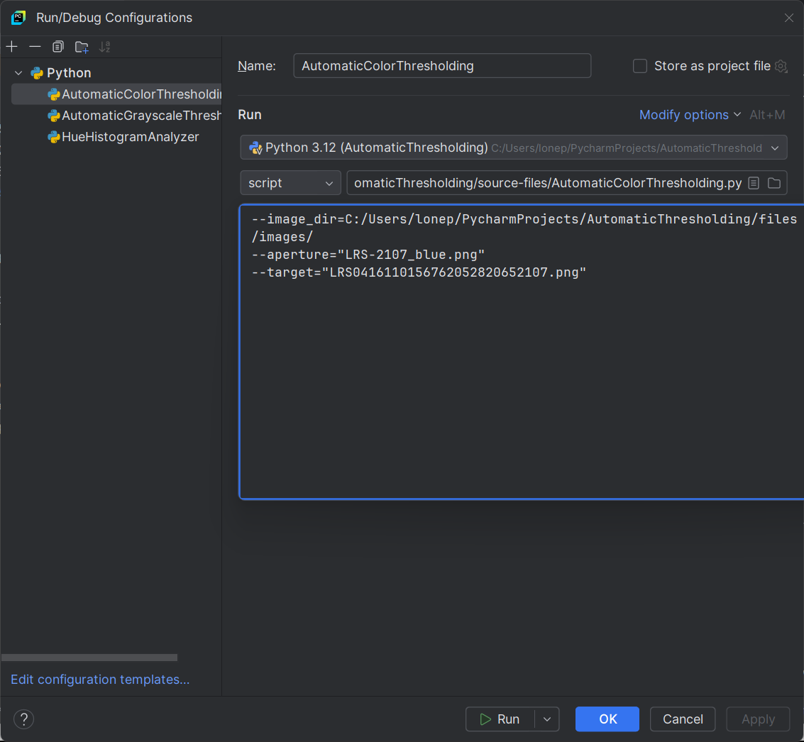

# AutomaticThresholding - proof-of-concept
 A Python/PyCharm project for the automatic thresholding
 of IntoTheDeep samples.

This project came about because of the difficulty we had in adjusting
to lighting conditions at the various venues we competed in during the
IntoTheDeep season. We did the bulk of our testing in our own lab but
we also had to contend with different lighting conditions at our
League Meet site, scrimmage sites at other schools, the Southern
California Regional site, and the practice and competition fields at
the World Championships.

To follow this discussion you should have some familiarity with
thresholding in OpenCV, that is,
the functions threshold() for grayscale and inRange() for the HSV
color space. The website
(https://learnopencv.com/opencv-threshold-python-cpp/) contains a
good introduction to the
binary thresholding of grayscale images and the standard OpenCV
website
(https://docs.opencv.org/3.4/da/d97/tutorial_threshold_inRange.html) supplies background on HSV
and has examples of inRange() in c++, Java, and Python.

For the IntoTheDeep season Team 4348 used both grayscale and HSV
inRange() thresholding and the AutomatedThresholding project handles
both, but we'll start the discussion with HSV because we had more
trouble tuning HSV than grayscale and FTC teams frequently use the
HSV color space for image recognition.

The AutomaticThresholding project is coded in Python and runs in the
PyCharm IDE on Windows 11. The source of all images is the Limelight
3A mounted on the "arm" of our robot that we could extend into the
Submersible to capture images looking down.

## Background
### Initial HSV inRange() arguments

In our lab and in the League Meet venue we were able, for the recognition of blue samples, to use the following 
arguments for hue, saturation and value: hue low 100, hue high 125, saturation low 75, saturation high 255, value low 75, value high 255.
For the image LRF0306142843552997990081623.png obtained in our lab, we call inRange() to isolate the blue samples. The top panel shows the original image; the bottom panel shows the satisfactory thresholded result.

### Hue change

But during pre-meet testing at the Southern California Regional, the same HSV arguments
produced unsatisfactory results due to different lighting conditions.

To remedy this problem we had to change hue low from 100 to 110 and the thresholded results changed to what we expected.

### Saturation change

On the World Championship competition field our pre-match testing again yielded unsatisfactory results,
this time because the lighting required a different saturation argument. 

To remedy this problem we had to change the saturation low argument from 125 to 205.

## Automatic thresholding

At both the Southern California Regional and the world Championship it was time-consuming and stressful
to analyze images with stand-alone tools to figure out which inRange() arguments to change and by how much.

The AutomaticThresholding project is based on
the online article on the website pyimagesearch.com "Automatic
color correction with OpenCV and Python" by Adrian Rosebrock on
February 15, 2021: https://pyimagesearch.com/2021/02/15/automatic-color-correction-with-opencv-and-python/.
The goal of the article and accompanying code
is to match the color histogram of an input image of a Pantone
color card with that of a reference Pantone card. Our AutomaticThresholding project follows
the pyimagesearch article in its use of a Pantone color card and
ArUco marker recognition but stops short of histogram matching.

### Workflow

1. Choose a calibration image that contains a single sample. Here's one from the World Championship competition field that shows a reddish halo around a blue sample.

We follow pyimagesearch in scaling and cropping the Pantone card down to the borders defined by the ArUco markers that
are part of the card. 

2. Make use of the aperture in the Pantone card.

The size of the cropped card is 339x314 and the size of the aperture at the center of the card is width 85 x height 60. In GIMP we manually snip a swatch of blue from our calibration image that is exactly the same size as the aperture, 85x60 and, in code, place it on top of the aperture.

Remember, this is a proof-of-concept; we'll talk about how to automate this process later.

 
3. Using OpenCV calcHist() we get the histogram of the color behind the aperture. This shows where the concentration of hue is in the aperture. The code determines the hue range by looking at the histogram bins to the left and right of the bin with the the highest concentration until it finds a bin with the lowest concentration. The hue range in the blue sample is 107 to 121.

4. Determine the HSV saturation by iteration.

After hue, saturation has the most effect on thresholding. We start with
a low  saturation parameter of 62, which is the minimum saturation for
the full image.
We then apply inRange(), OpenCV findContours(), and minAreaRect
(to get RotatedRectangles) and check the results. What we're looking
for is a single RotatedRectangle and a minimum number of low-area
artifacts (specks). If the result is not in range then we change the
saturation level either up or down and try again.

For the full image of the blue sample, LRS0416110156762052820652107.png,
we get the following final HSV inRange parameters: 
hue low 107, hue high 121;
saturation threshold low 207;
value threshold low 94

When we apply these HSV arguments to the full image of the single blue sample, including the reddish halo,
we get the following binary result.

What's more important is that this same set of arguments holds
for other images with samples of all three colors, as long as the lighting conditions are the same.

There are still a few artifacts - small white specks - in the final output.
These can be eliminated by 1. further tuning the saturation algorithm
 2. filtering out the specks by area or 3. eliminating the specks by OpenCV erosion.

5. For the time being do not tune the HSV value argument.

Currently in the code the HSV value argument is set to the minimum 
value level for the full image and is left unchanged.
There is a TODO in the code that mentions
the possibility of tuning the value argument using the same iterative
approach as that for saturation. We'll wait for the 2025 - 2026 game
announcement to decide whether this refinement is necessary.

6. Results

The code successfully thresholds the three
images of single samples - blue, red, and yellow - that are in the "files" directory of the Github
repository.

Instructions for setting the command-line arguments to specify which sample and which aperture swatch
to use are included in the README.md file for the project.

## A note on grayscale thresholding

Grayscale thresholding is both easier and harder than HSV. It's easier
because there is only one argument, the low threshold level, instead of
the three required for HSV inRange(). But grayscale thresholding can be
more complicated because there is more than one way to get grayscale
from a BGR image. For example, the best thresholding results for the
single blue sample used above start with the grayscale image derived from
splitting the BGR image into its three constituent channels and then
inverting the red channel.

It's also tempting to think that other grayscale thresholding techniques
such as Adaptive and Otsu might lend themselves to our sample images. But
this did not prove to be the case.

## Beyond the proof-of-concept

### Custom ArUco marker template

The use of the Pantone card for the current project is a convenience; the card includes
ArUco markers at its corners and has an aperture in the center at a fixed distance
from the corners. And pyimagesearch supplied code for the recognition and
normalization of the card.

For IntoTheDeep samples it would be better to create a custom
template (on a piece of card stock, for example) with its own
ArUco markers and an aperture large enough to expose the full
size of a sample. But we'll defer implementation of this approach
until we're sure that it will apply to the 2025 - 2026 game.

### Real-time capture of calibration images

The workflow would start with a stand-alone TeleOp OpMode; the driver would
use gamepad buttons to select HSV or toggle through a selection of grayscale sources
(such as "full grayscale",
"red channel grayscale", or "green channel inverted"). The OpMode would send a request
to and receive results from either:

    - A Limelight 3A running a custom Python script
    - A VisionPortal webcam controlled by Java code that runs on the Robot Controller

In both cases the TeleOp OpMode would write the results to an XML file that Autonomous
would read in.

The current project could be ported to the Limelight itself as a custom
script. For this to happen, the code would need to be merged into
a single Python file and the results, i.e. the HSV arguments to
inRange() would be have to be encoded
into the Limelight output format, an array of doubles. All
file writing and display of intermediate results would have to be
removed since the Limelight does not support these operations.

The current project could also be ported to Java so that it could be run
by the TeleOp OpMode mentioned above. An advantage of a port to Java is
that intermediate files and logs could be written to the file system on
the Robot Controller for examination during debugging.

### Comments and questions embedded in the code

The proof-of-concept project in the Github repository contains a number of
comments and questions marked with ##**TODO. Some note conditions to watch
out for, some point in the direction of future releases.

## Run configurations and command-line arguments
This section describes the command-line arguments that you need to
supply in order to run automatic OpenCV thresholding for HSV and
grayscale.

There are three pairs of images: each pair consists of an image
of a single sample and a swatch manually extracted from the
sample with GIMP.

- red: LRS0416110134896829731740245.png and LRS-0245_red.png
- blue: LRS0416110156762052820652107.png and LRS-2107_blue.png
- yellow: LRS0416110227864257037094021.png and LRS-4021_yellow.png

The same three pairs of images are used for the automatic thresholding
of both HSV and grayscale.

### HSV

### Grayscale

The --source argument identifies the means by which the input
RGB image is converted to grayscale.

    "BLUE_CHANNEL"
    "BLUE_CHANNEL_INVERTED"
    "GREEN_CHANNEL"
    "GREEN_CHANNEL_INVERTED"
    "RED_CHANNEL"
    "RED_CHANNEL_INVERTED"
    "COLOR_TO_GRAY"

For the three samples the best results were obtained with the following
--source arguments:

- red: --source="RED_CHANNEL"
- blue --source="RED_CHANNEL_INVERTED"
- yellow -- source="GREEN_CHANNEL"

